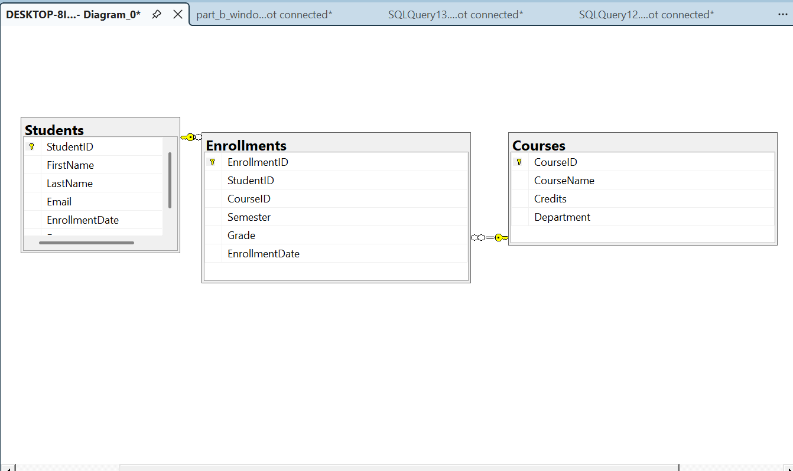
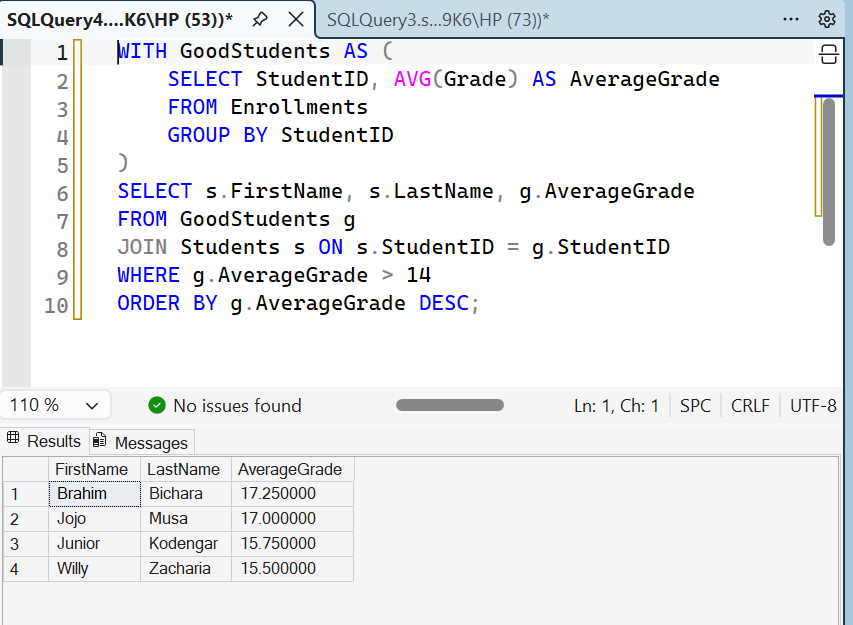

Database Programming Assignment 1 — Student Information System
Student: Junior Kodengar (30057_2025)
Course: C11665 - DPR400210: Database Programming
Instructor: Eric Maniraguha

Business Problem
This project implements a Student Information System for a university. The system manages students, courses, and enrollments (including grades), allowing the institution to track academic performance, analyze trends across semesters, and identify students who may need academic support.

 Database Schema
The database consists of 3 related tables:

- tudents(StudentID PK, FirstName, LastName, Email, EnrollmentDate, Department)
- Courses(CourseID PK, CourseName, Credits, Department)
- Enrollments(EnrollmentID PK, StudentID FK, CourseID FK, Semester, Grade, EnrollmentDate)

 ER Diagram

 Part A: CTE Implementations

 1. Simple CTE — Students with average grade above 14
Identifies high-performing students for merit lists or scholarships.

 2. Multiple CTEs — Pass/Fail classification
Classifies students as Pass/Fail based on a 12/20 threshold, useful for identifying students needing academic support.

 3. Recursive CTE — Semester sequence generator
Generates a sequence of semester numbers (1–10), useful for academic calendar planning.

 4. CTE with Aggregation — Course statistics
Calculates total enrollments, average, max, and min grade per course to identify difficult courses.

 5. CTE with JOIN — Best grade per student
Identifies each student's best academic performance and the course in which it was achieved.

 Part B: Window Function Implementations

 1. Ranking Functions (ROW_NUMBER, RANK, DENSE_RANK, PERCENT_RANK)
Ranks students by average grade to identify top and bottom performers.

 2. Aggregate Window Functions (SUM, AVG, MAX, MIN OVER)
Compares each individual grade to the student's own overall statistics without collapsing rows.

 3. Navigation Functions (LAG, LEAD)
Tracks each student's grade progression between Fall2025 and Spring2026 per course.

 4. Distribution Functions (NTILE, CUME_DIST)
Splits students into performance quartiles and shows cumulative distribution of grades.

*(See screenshots in repository for detailed outputs of each Window Function category.)*

 Analysis and Findings

 Descriptive Analysis
Average grades range from 11.6 to 17.25. Brahim Bichara has the highest average (17.25), while Bobo Abba has the lowest (11.625). "Web Development" has the lowest average grade among the 4 courses (14.17), while "Database Programming" has the highest (15.58). 5 out of 6 students passed (≥12), with 1 failing.

 Diagnostic Analysis
LAG/LEAD analysis shows most students improved between Fall2025 and Spring2026 (e.g., +1.00 for Junior and Brahim), suggesting growing familiarity with course material. "Web Development" being the weakest course may indicate higher technical difficulty. Bobo Abba's consistently low grades across courses suggest a general academic struggle rather than a single weak subject.

 Prescriptive Analysis
- Implement tutoring/mentorship support for students below the passing threshold (e.g., Bobo Abba)
- Review and reinforce the "Web Development" curriculum with additional practical sessions
- Create a peer mentoring program pairing top-quartile students with struggling peers
- Continue semester-by-semester tracking with LAG/LEAD to detect early performance decline

 References
- Microsoft SQL Server Documentation — Common Table Expressions
- Microsoft SQL Server Documentation — Window Functions (OVER clause)
- Course materials: DPR400210 - Database Programming, UNILAK

 Academic Integrity Statement
I confirm that this assignment is my own original work. All SQL scripts, database design, and analysis were developed independently by me, in accordance with university academic integrity policies.
